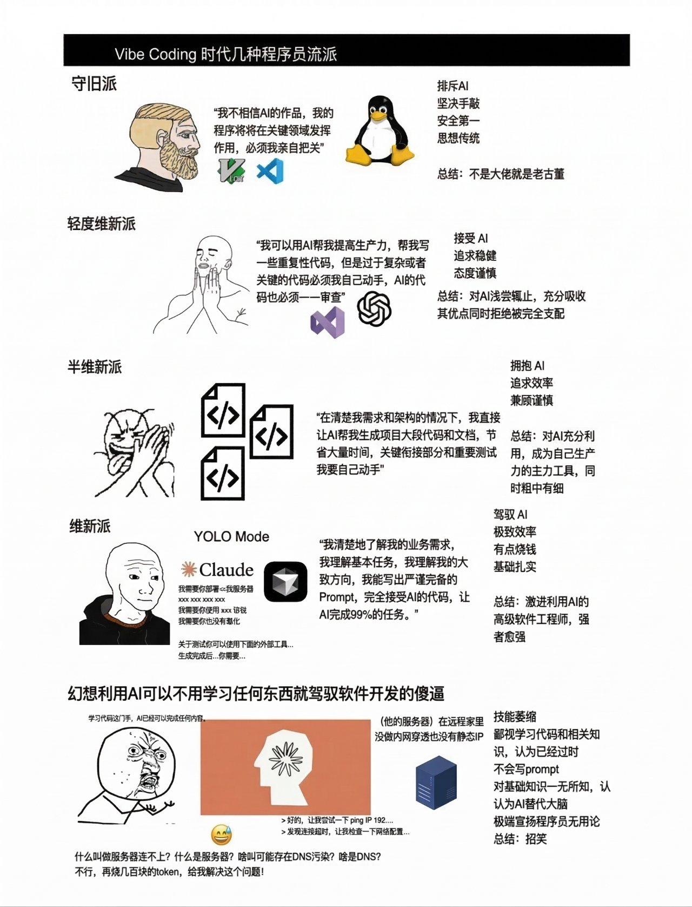

这两天，一张“Vibe Coding 时代几种程序员流派”的图在群里刷屏。

发小把图甩给我，问我：“你算第二派吗？”

我回他：**我更像介于第三派和第四派之间。第四派代表未来趋势，第五派则是很多刚接触 AI 的外行现状。**

这张图能火，不是因为它有多严谨，而是因为它确实戳中了当下 AI 编程圈最真实的一种焦虑和分裂：

- 有人还在抗拒 AI
- 有人把 AI 当自动补全
- 有人开始把 AI 当生产力主工具
- 也有人已经在“驾驶 AI”做完整交付
- 当然，还有一批人，真的以为自己不用懂技术，只要会烧 token 就能把软件开发搞定

但在我看来，大家如果还停留在“你是哪一派”的讨论，已经有点落后了。

因为今天 AI 编程真正的分水岭，已经不是“你信不信 AI”，而是：

**你有没有能力去约束 AI、组织 AI、把 AI 纳入自己的工作流。**

## 先说我的结论

一句话总结我这篇文章的核心观点：

**模型能力当然重要，但从 2026 年开始，AI 编程的主要差距已经从“模型差距”，转向“使用差距”和“方法论差距”。**

也就是说：

- 你用的是不是顶级模型，当然会影响上限
- 但你能不能把同一个模型用明白，决定的是下限和稳定度

同样是 `Codex`，同样是 `GPT`，同样一个目标，几个人做出来的结果却能差很多。这件事我不是抽象理解，而是最近在自己的 `vibe coding` 交流群里越来越明显地感受到。

## 一、我不是一开始就站在第三、第四派

很多人现在回头看，会有一种错觉：仿佛 AI 编程从一开始就很强。

其实不是。

我第一次真正使用 AI 编程，是 **2025 年 3 月**。第一款产品是 `Trae`。到了 **2025 年 4 月**，我才开始用 `Cursor`。那时 `Sonnet 3.7` 刚出来，今天回头看，那个阶段的 AI 编程其实非常原始。

原始到什么程度？

- 模型能力和今天比，差距明显
- 上下文窗口小，稍微一长就开始失忆
- 对产品和业务的理解非常浅
- 代码检索能力很弱
- 几乎没有成熟的 `skills` 体系
- `agent.md` 这种明确规则文件还没形成共识
- `MCP` 也才刚开始被更多人用起来

说白了，那个阶段的 AI 编程，更像一个“会写一些代码的高级聊天助手”。它能帮你提效，但很难真正理解项目，更难说稳定执行。

所以那时候的我，其实就是这张图里的**第二派**：

我接受 AI，愿意让它提高生产力，但关键代码我必须亲自盯，复杂业务我不敢全交给它。

这不是保守，这是那个时间点最现实的选择。

## 二、让我从第二派走向第三派的，不是口号，是产品能力真的变了

到了 **2025 年下半年**，我开始密集使用 `Augment`、`Kiro`、`Windsurf`、`Warp` 等产品，`Sonnet` 也来到了 4。

这个阶段我最大的感受是：**AI 编程终于开始有“工程能力”了。**

尤其是 `Augment`，它给我的冲击很大。

我一直觉得 `Augment` 最大的问题是慢，但除了慢，它真的让我第一次明显感觉到：

- 它不只是补代码
- 它在尝试理解项目
- 它在尝试理解产品逻辑
- 它不是围绕一个函数工作，而是围绕一个需求在工作

这件事很关键。

因为 AI 编程一旦开始从“补全代码”升级成“理解需求并执行任务”，开发者的角色就会发生变化。你不再只是敲代码的人，而开始变成：

- 提需求的人
- 定规则的人
- 做验收的人
- 控节奏的人

这也是我为什么会从第二派走向第三派。

不是因为我忽然更激进了，而是因为产品能力真的变了。

## 三、2026 年开始，第四派会越来越像主流

到了 **2026 年上半年**，我自己的状态已经明显介于第三派和第四派之间。

这时候我开始大量使用 `Codex`，也越来越依赖一套更明确的约束方式去控制 Agent，比如：

- `skills`
- `MCP`
- `agent.md`
- 项目规则
- 上下文分层
- 明确的执行边界

我越来越不把 AI 编程理解成“你给它一句 Prompt，它帮你出一段代码”。

我现在更倾向于把它理解成：

**你在运营一个会写代码的执行系统。**

这个系统能不能跑得好，不在于你给它一句多华丽的话，而在于：

1. 你有没有把任务定义清楚
2. 你有没有把规则边界写清楚
3. 你有没有给它稳定的上下文和工具
4. 你有没有设计出一套可复用的工作流

这也是为什么我认为第四派才是未来趋势。

未来的 AI 编程，不会越来越像 IDE 的附属功能，而会越来越像一个独立工作界面。你主要在和 AI 对话、给 AI 分配任务、给 AI 提供规则、查看 AI 产出；至于代码本身，反而会逐渐退到后台，必要时再去 IDE 检查。

这也是为什么现在 `Codex`、`Antigravity`、`Claude` 的桌面端，都会越来越往这个方向走。

它们正在把“代码编辑器 + 聊天框”的模式，逐步推向“AI 执行台 + 人类约束器”的模式。

## 四、未来不是“不看代码”，而是“人从写代码变成约束代码生成”

很多人一听到“未来你可能不用经常看代码”，会立刻反感。

但我觉得这里要说清楚：**不看代码，不等于不懂代码。**

真正的趋势不是让人彻底离开技术，而是让人的精力从“机械实现”转向“规则设计、任务拆解、结果校验、架构判断”。

换句话说，未来更像是：

- AI 负责大部分执行
- 人负责定义目标、约束过程、判断结果

这和今天很多人理解的“AI 替你写几行函数”完全不是一回事。

所以我一直不认同一种很粗暴的说法：  
“以后程序员都不用学技术了，只要会和 AI 聊天就行。”

这是典型的第五派幻觉。

第五派最典型的问题，不是他喜欢 AI，而是他把 AI 当成大脑替代品，而不是能力放大器。

这种人常见的状态是：

- 对服务器、部署、网络、插件、环境一知半解
- 遇到问题第一反应不是定位原因，而是继续问 AI
- 以为 token 烧得够多，问题自然会解决
- 把“不会写 Prompt”当成唯一障碍
- 轻视基础知识，甚至觉得学习代码已经过时

这类人短期看起来很热情，长期大概率会被现实教育。

因为 AI 可以帮你压缩实现成本，但**不能替你建立判断力**。

## 五、我在群里的一个观察：同样用 Codex，结果为什么还是不一样

最近一个感受特别深。

我在自己的 `vibe coding` 交流群里和大家交流，发现一件事：我们很多人其实用的是同样的工具。

- 都在用 `Codex`
- 都在用 `GPT`
- 目标也差不多，都是想让 AI 更好地完成任务

但最后跑出来的结果，经常完全不一样。

这类事情看起来像小问题，但特别能说明本质：

**AI 能力是一回事，怎么使用 AI 是另一回事。**

很多人会把结果差异理解成模型差异，实际上未必。

很多时候差距来自：

- 你是否知道该给 AI 什么上下文
- 你是否知道问题该怎么描述
- 你是否知道什么时候该让 AI 自己装插件、自己改配置
- 你是否知道什么时候该停下来做人工判断
- 你是否有一套成熟的工作流，而不是完全临场发挥

同一个模型，不同人手里跑出来不一样的结果，这不是偶然，这是 AI 编程进入下一阶段后的常态。

## 六、为什么 2026 年之后，方法论会比“会不会写 Prompt”更重要

过去大家讲 AI 编程，最爱讲的是 Prompt。

但我现在越来越觉得，`Prompt Engineering` 这个词本身都快不够用了。

因为真正起作用的，已经不是单条 Prompt，而是一整套协作方法论：

- 需求怎么定义
- 规则怎么写
- 上下文怎么组织
- Tool Use 怎么接
- MCP 怎么管
- skills 怎么路由
- agent.md 怎么约束
- 结果怎么验收

你会发现，真正成熟的 AI 编程用户，最后拼的不是“谁更会说一句漂亮话”，而是：

- 谁更懂业务
- 谁更懂系统
- 谁更懂任务拆解
- 谁更懂工作流设计

所以我很想下一个判断：

**未来最强的 AI 编程用户，不一定是最会写代码的人，但一定是最会设计规则和流程的人。**

这也是为什么我一直强调：AI 只能是辅助，能不能用得好，完全看人，看方法论，看工作流。

## 七、五派图只是情绪标签，真正的行业分层其实只有两类人

如果把这张五派图再往下抽象，我觉得最后其实会收敛成两类人。

第一类人是：

**把 AI 当工具的人。**

他们知道 AI 很强，但更知道它不稳定；他们会用它、约束它、纠正它、把它接进自己的工作流。

第二类人是：

**把 AI 当幻想的人。**

他们希望 AI 直接替自己解决能力缺口，希望不学习、不理解、不判断也能完成复杂开发。

前者会越来越强，因为 AI 会不断放大他们的生产力。  
后者会越来越焦虑，因为 AI 每次失灵，暴露的都是他们本来就没有的基础能力。

所以五派图看着像是在分“态度”，但本质上分的是：

- 你有没有真实能力
- 你有没有工程判断
- 你有没有把 AI 纳入生产体系

## 八、我的最终判断

最后给一个我现在非常确定的判断：

**第四派会逐渐成为主流，但前提不是大家都更懂模型了，而是大家都不得不学会怎么约束 Agent。**

未来的 AI 编程会越来越像这样：

- 你不需要事无巨细自己敲代码
- 但你必须懂产品、懂业务、懂架构、懂边界
- 你不一定天天盯着 IDE
- 但你一定要会设计规则、会组织上下文、会管理执行过程

这条路不是“程序员消失”，而是“程序员角色重构”。

以前拼的是写代码速度。  
以后拼的是：

- 任务定义能力
- 流程设计能力
- 规则约束能力
- 结果验收能力

如果你问我现在属于哪一派，我还是会说：

**我介于第三派和第四派之间。**

但如果你问我未来哪一派会赢，我的答案会更明确：

**不是最激进的那派，也不是最保守的那派，而是最会约束 AI 的那派。**
